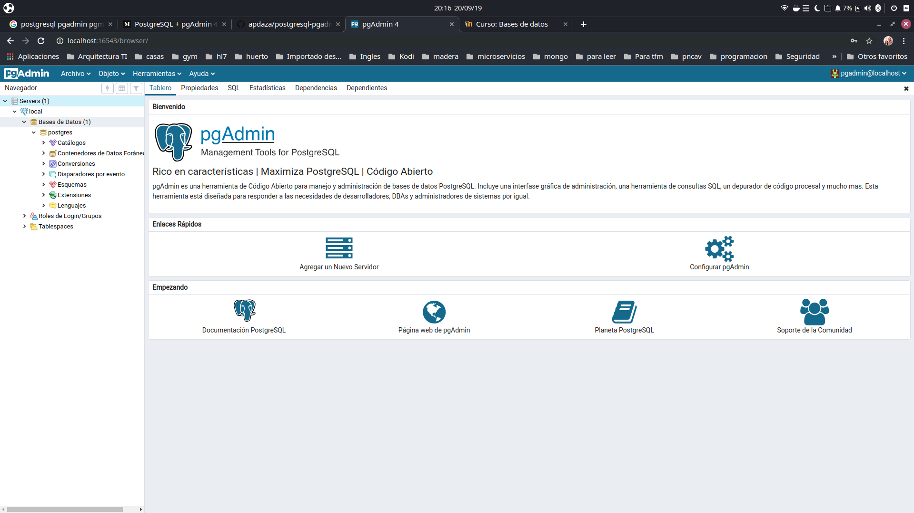

# Entorno dockerizado de postgresql y pgadmin4

Para poner a andar el entorno clonar este repositorio

<code>
git clone https://github.com/apdaza/postgresql-pgadmin4.git
</code>

Ejecutar el docker-compose

<code>
docker-compose up -d
</code>

En el navegador vamos a http://localhost:16543

